<picture>
  <source media="(prefers-color-scheme: dark)" srcset="./assets/hero-dark.svg">
  
</picture>

 

I'm **dickbown**. I build AI products: agent systems, creative tooling, and full-stack apps.
I care about the part people touch as much as the part they never see.

 

### Projects

| Project | What it is | Stack |
| :--- | :--- | :--- |
| **[wenyao](https://github.com/ROTl24/wenyao)** | Evidence-driven Liuyao desktop app: deterministic hexagram facts, classical sources, and constrained AI interpretation. | TypeScript · Windows |
| **[ai&#8209;dev&#8209;workflow&#8209;system](https://github.com/ROTl24/ai-dev-workflow-system)** | An open delivery workflow for AI coding tools: Codex, Claude Code, Cursor, Gemini CLI, and GitHub Copilot. | PowerShell · Markdown |
| **[ai&#8209;web&#8209;generator](https://github.com/ROTl24/ai-web-generator)** | From a natural-language prompt to a complete, deployable web project. | Java |
| **[daily&#8209;summary&#8209;agent](https://github.com/ROTl24/daily-summary-agent)** | Local workbench that turns Git evidence and notes into daily Markdown summaries. | JavaScript |
| **[tiktok&#8209;ai&#8209;skills](https://github.com/ROTl24/tiktok-ai-skills)** | Agent skill: product photo in, shoot-ready UGC ad plan out. Storyboard-first, with compliance routing. | Agent Skill |
| **[pet&#8209;github](https://github.com/ROTl24/pet-github)** | Mika, a small animated desktop companion for Codex. | Desktop |

 

### Now

Reliable agents &nbsp;·&nbsp; thoughtful interfaces &nbsp;·&nbsp; open-source tooling

 

### Contact

<a href="mailto:xdickbown@gmail.com">xdickbown@gmail.com</a>

