  

  

 

### ⌘ Projects

**[wenyao](https://github.com/ROTl24/wenyao)** · TypeScript · Windows
An evidence-driven Liuyao desktop app: deterministic hexagram facts, classical sources, and constrained AI interpretation.

**[tiktok-ai-skills](https://github.com/ROTl24/tiktok-ai-skills)** · Agent Skill
Turns a product photo into a shoot-ready TikTok UGC ad plan. Storyboard-first, with US/CN compliance routing and hard guardrails against fabricated claims.

 

### ↗ Upstream pull requests

Fixes I've sent to repositories I don't own, newest first.

<!-- prs:start -->
| | Repository | Pull request | |
| :-- | :-- | :-- | --: |
| `merged` | [NandhaKishorM/laya](https://github.com/NandhaKishorM/laya) | [fix(lang): recognize Armenian text when routing requests](https://github.com/NandhaKishorM/laya/pull/23) | 2026&#8209;09&#8209;20 |
| `open` | [vercel-labs/json-render](https://github.com/vercel-labs/json-render) | [fix(core): escape JSON Pointer keys in flattenToPointers](https://github.com/vercel-labs/json-render/pull/345) | 2026&#8209;09&#8209;19 |
| `closed` | [python-pillow/Pillow](https://github.com/python-pillow/Pillow) | [Keep ImageOps.contain dimensions at least one pixel](https://github.com/python-pillow/Pillow/pull/9998) | 2026&#8209;09&#8209;13 |
| `merged` | [microsoft/markitdown](https://github.com/microsoft/markitdown) | [Trim CSV blank runs without repeatedly shifting the row list](https://github.com/microsoft/markitdown/pull/2450) | 2026&#8209;09&#8209;10 |
| `open` | [theskumar/python-dotenv](https://github.com/theskumar/python-dotenv) | [Fix variable expansion in dotenv run --no-override](https://github.com/theskumar/python-dotenv/pull/698) | 2026&#8209;09&#8209;08 |
| `merged` | [msitarzewski/agency-agents-app](https://github.com/msitarzewski/agency-agents-app) | [Prevent background console windows from flashing on Windows](https://github.com/msitarzewski/agency-agents-app/pull/85) | 2026&#8209;08&#8209;10 |

Updated 2026-09-23 · regenerated daily by GitHub Actions
<!-- prs:end -->

 

### ✉ Contact

<a href="mailto:xdickbown@gmail.com">xdickbown@gmail.com</a>
