<div align="center">
  <a href="https://github.com/ROTl24">
    
  </a>
</div>

<br />

<div align="center">
  <strong>I turn messy ideas into useful, well-crafted AI products.</strong>
  <br />
  <sub>Agent systems · full-stack products · creative tooling</sub>
</div>

<br />

<div align="center">
  <a href="https://github.com/ROTl24?tab=repositories">Selected work</a>
  &nbsp;·&nbsp;
  <a href="mailto:xdickbown@gmail.com">Say hello</a>
</div>

<br />

## Selected work

<table>
  <tr>
    <td width="50%" valign="top">
      <code>01 / DESKTOP AI</code>
      <h3>问爻 · WenYao</h3>
      <p>A Windows-first ink-wash desktop app that connects deterministic Liuyao facts, classical evidence, and constrained AI interpretation.</p>
      <p><code>Electron</code> <code>React</code> <code>TypeScript</code> <code>Three.js</code></p>
      <a href="https://github.com/ROTl24/wenyao">Explore the project ↗</a>
    </td>
    <td width="50%" valign="top">
      <code>02 / AGENTIC BUILD</code>
      <h3>AI Web Generator</h3>
      <p>A natural-language platform for generating, iterating, versioning, and deploying complete web applications through an agentic workflow.</p>
      <p><code>Java</code> <code>LangGraph4j</code> <code>Vue</code> <code>TypeScript</code></p>
      <a href="https://github.com/ROTl24/ai-web-generator">Explore the project ↗</a>
    </td>
  </tr>
  <tr>
    <td width="50%" valign="top">
      <code>03 / DEV SYSTEMS</code>
      <h3>AI Dev Workflow System</h3>
      <p>An open workflow for turning AI coding tools into a reliable delivery process with roles, phase gates, test loops, and durable artifacts.</p>
      <p><code>Codex</code> <code>Claude Code</code> <code>Cursor</code> <code>Gemini CLI</code></p>
      <a href="https://github.com/ROTl24/ai-dev-workflow-system">Explore the project ↗</a>
    </td>
    <td width="50%" valign="top">
      <code>04 / PLAYFUL TOOLS</code>
      <h3>Mika</h3>
      <p>A tiny animated desktop companion for Codex — equal parts character design, motion study, and developer delight.</p>
      <p><code>Pixel Art</code> <code>Motion</code> <code>Open Source</code></p>
      <a href="https://github.com/ROTl24/pet-github">Meet Mika ↗</a>
    </td>
  </tr>
</table>

<br />

## Working principles

```text
Truth before theater.       Build deterministic foundations before AI interpretation.
Taste is a requirement.     Utility and craft belong in the same product.
Ship the whole thing.       From architecture and tests to the artifact people can use.
```

<br />

<div align="center">
  <sub>MAKE IT USEFUL · MAKE IT CLEAR · MAKE IT LAST</sub>
  <br /><br />
  <a href="mailto:xdickbown@gmail.com"><strong>Let’s build something worth using. ↗</strong></a>
</div>

