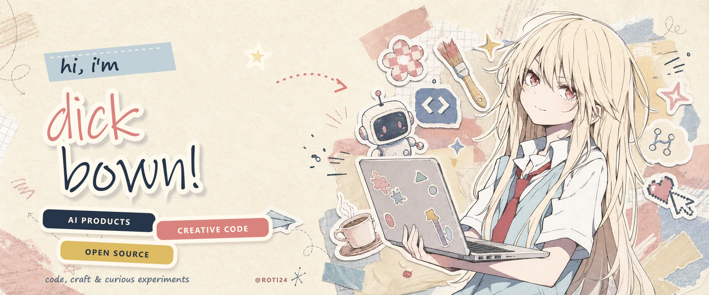
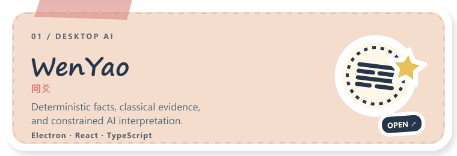
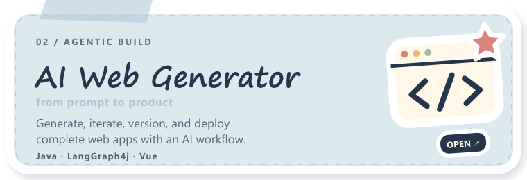
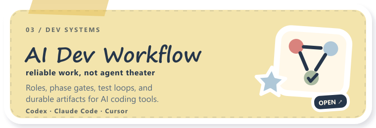
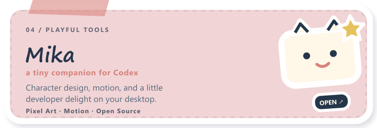
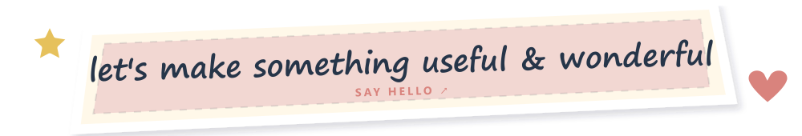

  

 

  <strong>I make AI products that feel useful, human, and a little bit magical.</strong>
   
  Turning complicated ideas into working tools — with equal care for the system and the surface.

 

  <code>agent systems</code>
  &nbsp;·&nbsp;
  <code>creative tooling</code>
  &nbsp;·&nbsp;
  <code>full-stack products</code>
  &nbsp;·&nbsp;
  <code>open source</code>

 

  

  

  

  

  

 

  CURRENTLY COLLECTING
   
  <strong>reliable agents · thoughtful interfaces · open-source stories</strong>

 

  

